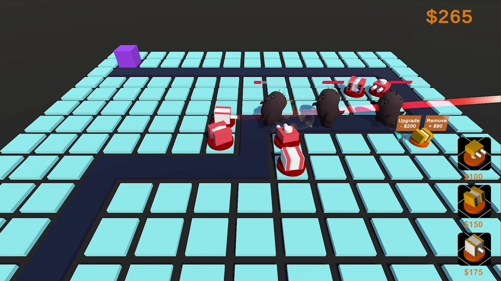

# Cubic Defense

Cubic Defense is a 3D tower defense game made with unity 5.

The goal of the game is to protect the headquarter from being invaded by waves of enemies.

## Mechanics

The player can pay certain amount of money to build turrets.

Turrets can attack to cause damage to enemies. Different type of turrets have different attack styles.

Enemies have different types and levels. High-level enemies have larger body size, faster speed, and more life points.

When an enemy reaches the headquarter, it decreases the health point of the headquarter by 1. The game will be over if the health point becomes 0.

When an enemy dies, the player can gain some money as reward. High-level enemies will give more money.

The player may upgrade an existing turret to increase its power.

The player may remove an existing turret and gain part of its original price.

## Game Actors

### Turrets

- Standard  Turret: Shoot bullet to cause standard amount of damage to a single enemy.

  The upgrade version: Larger attack range and higher attack speed.

- Missile Turret: Launch missiles that will explode and cause a large amount of damage to the target enemy. Any enemies within explosion range will receives a small amount of damage.

  The upgrade version: Larger attack range, larger explosion range, and higher damage.

- Laser Turret: Emit laser to cause a standard amount of damage to enemies in a row.

  The upgrade version: Larger attack range and wider laser beam.

### Enemies

- Bat Enemy: High speed but low life points. 3 different levels. Few rewards when killed.
- Rodent Enemy: Low speed but high life points. 3 different levels. Fair rewards when killed.
- Gorilla Enemy: Very high speed and very high life points. 2 different levels. Huge rewards when killed.